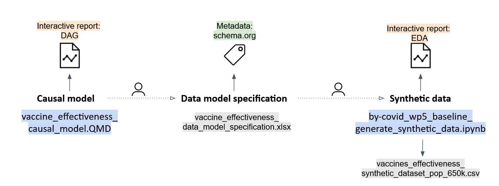
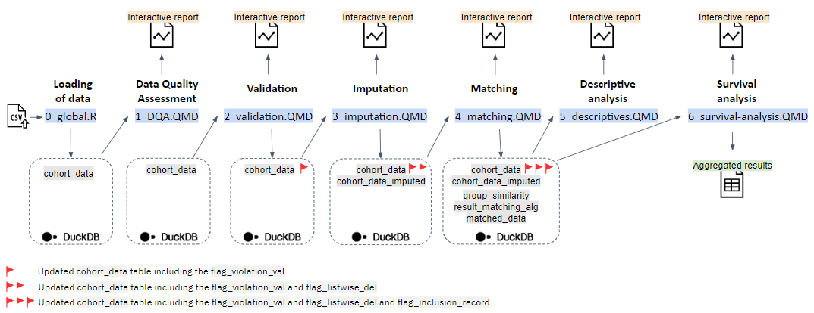

# BY-COVID - WP5 - Baseline Use Case: SARS-CoV-2 vaccine effectiveness assessment

This repository is making an RO-Crate of the [BY-COVID](https://by-covid.org/) **WP5 T5.2** baseline use case on "*SARS-CoV-2 Vaccine(s) effectiveness in preventing SARS-CoV-2 infection*".

## RO-Crate preview

The RO-Crate can be browsed at <https://by-covid.github.io/BY-COVID_WP5_T5.2_baseline-use-case/> (HTML) and as [ro-crate-metadata.json](https://by-covid.github.io/BY-COVID_WP5_T5.2_baseline-use-case/ro-crate-metadata.json)

## Description

### Background information

Task 5.2 aims to demonstrate how mobilisation of **real-world** population, health and care data across national borders can provide answers to policy-relevant research questions. Eventually, it aims to prototype *a workflow that is standard for population health research*. Here, the research question is approached by identifying a **causal effect** that allows to evaluate a public health intervention. As such, a methodology for approaching causal inference when conducting **federated** research is proposed and demonstrated, guaranteeing different layers of **interoperability** (i.e., legal, organisational, and semantic interoperability).

The methodological framework comprises the following steps:

-   Defining the research question and the exposure-outcome relationship
-   Establishing a causal model using Directed Acyclic Graphs (DAGs)
-   Translating the causal model into data requirements using a Common Data Model (CDM)
-   Generating synthetic data and developing an interoperable analytical pipeline
-   Mobilising individual-level data within each of the nodes and transforming the data to comply with the CDM
-   Deploying the interoperable analytical pipeline within the secure processing environment (SPE) of each of the nodes (*Data Hubs*)
-   Meta-analysis of the aggregated results

### Use case

The current use case aims to answer the following research question: "*How effective have the SARS-CoV-2 vaccination programmes been in preventing SARS-CoV-2 infections?*"

For more information, please consult the [study protocol](https://doi.org/10.5281/zenodo.7551181).

## Overview of content

The current repository contains the following pieces:

-   The [**Study Protocol**](https://doi.org/10.5281/zenodo.7551181) (vaccine_effectiveness_study_protocol)
    -   Study protocol (PDF)
-   The [**Causal Model**](https://doi.org/10.5281/zenodo.6913045) (vaccines_effectiveness_causal_model)
    -   Interactive report showcasing the structural causal model as a DAG (HTML)
    -   Script to produce the causal model as a DAG (QMD)
-   The [**Common Data Model specification**](https://doi.org/10.5281/zenodo.6913045) (vaccines_effectiveness_common_data_model_specification)
    -   Human-readable common data model specification (XLSX)
    -   Human-readable metadata file (schema.org compliant) created with dataspice as an interactive report (HTML)
    -   Machine-readable structured metadata file (schema.org compliant) created with dataspice (JSON)
-   The [**Synthetic Data**](https://doi.org/10.5281/zenodo.6913045) (vaccines_effectiveness_synthetic_dataset)
    -   Script to generate the synthetic dataset (IPYNB)
    -   Synthetic dataset for 650,000 registries (CSV)
    -   Machine-readable version of the Exploratory Data Analysis (EDA) of the synthetic data (JSON)
    -   Interactive report of the Exploratory Data Analysis (EDA) of the synthetic data (HTML)
-   The **Analytical Pipeline** (vaccine_effectiveness_analytical_pipeline)
    -   Documentation of the methodology of the scripts in the analytical pipeline (PDF)
    -   Scripts of the analytical pipeline
        -   Upload the csv file and create a DuckDB database file (R)
        -   Exploration and Data Quality Assessment (DQA) of the original data mapped at each Data Hub (QMD)
        -   Validation (applying logic validation rules) of the original data mapped at each Data Hub (QMD)
        -   Imputation of missing values in the original data mapped at each Data Hub (QMD)
        -   Iterative matching of the exposed and unexposed (QMD)
        -   Descriptive analysis of the matched and unmatched study population (QMD)
        -   Survival analysis of the matched study population (QMD)
    -   Input for the analytical pipeline (CSV)
    -   Ouput of the analytical pipeline [^1]
        -   Interactive report with dataset statistics, missing data profiles, potential alerts, and detailed per-variable information (HTML)
        -   Interactive report summarizing compliance with the logic validation rules (HTML)
        -   Interactive report summarizing used imputation methods and number of imputed values
        -   Interactive report to assess matching balance in the obtained study population (HTML)
        -   Interactive report including the results of survival analysis in the unmatched study population, a table with baseline characteristics of the matched study population and CONSORT diagram (HTML)
        -   Interactive report including the analytic results for the meta-analysis (HTML)

[^1]: For illustrative purposes, the interactive reports contain the output of the scripts of the analytical pipeline applied to the synthetic dataset.

## Step-by-step

### Conceptual phase: the Common Data Model Specification

The first set of digital objects support *conceptually* what is needed to develop the analytical pipeline and have been published together as the [Common Data Model Specification](https://doi.org/10.5281/zenodo.6913045).



#### The causal model

A research team constructs a causal model responding to the proposed research question. A Quarto RMarkdown script (`vaccine_effectiveness.QMD`) produces the structural causal model (DAG) in an interactive HTML report (`vaccine_effectiveness_causal_model.html`).

#### The data model specification

A human translates the causal model into data requirements (no technical link) and constructs a CDM in a human-readable version (`vaccine_effectiveness_data_model_specification.xlsx`). A metadata file compliant to schema.org is produced using dataspice in both human-readable (`vaccine_effectiveness_synthetic_dataset_spice.html`) and machine-readable (`dataspice.json`) format.

#### The synthetic data

The data model specification is translated by a human (no technical link) into a Python script (Jupyter notebook) to generate the synthetic data (`by-covid_wp5_baseline_generate_synthetic_data_v.1.1.0.ipynb`). The script outputs (technical link) the synthetic data (`vaccines_effectiveness_synthetic_dataset_pop_650k.csv`). An interactive report with the Exploratory Data Analysis (EDA) of the synthetic data is created using [pandas-profiling (now ydata-profiling)](https://github.com/ydataai/ydata-profiling) in both human-readable (`vaccine_effectiveness_synthetic_dataset_eda.html`) and machine-readable format (`vaccine_effectiveness_synthetic_dataset_eda.json`).

### Implementation: the Analytical Pipeline

The next set of digital objects are the consecutive scripts of the analytical pipeline. The individual scripts of the analytical pipeline are technically linked to each other. More information on the methodology can be found in the [documentation](https://github.com/MarjanMeurisse/BY-COVID_WP5_T5.2_baseline-use-case/blob/main/vaccine_effectiveness_analytical_pipeline/documentation/BY-COVID-WP5-BaselineUseCase-VE-documentation-analytical-pipeline.pdf). For illustrative purposes, the [interactive reports](https://github.com/MarjanMeurisse/BY-COVID_WP5_T5.2_baseline-use-case/tree/main/vaccine_effectiveness_analytical_pipeline/output) as output of the analytical pipeline when applied to the synthetic dataset are provided.



#### Loading of data

**Script**: `0_global.R`

-   **Input**:
    -   `vaccine_effectiveness_synthetic_pop_10k_v.1.1.0.csv`
-   **Output**:
    -   `cohort_data`

A DuckDB database file is created (`BY-COVID-WP5-BaselineUseCase-VE.duckdb`). Data are imported from a csv file (e.g. `vaccine_effectiveness_synthetic_pop_10k_v.1.1.0.csv`) using the R package `Arrow` and inserted into the `cohort_data` database table within the `BY-COVID-WP5-BaselineUseCase-VE.duckdb`. Data types are manually specified according to the [Common Data Model Specification](https://zenodo.org/record/7572373#.ZC0ad_ZByUk) when reading the data using a schema.

#### Data quality assessment

**Script**: `1_DQA.QMD`

-   **Input**:
    -   `cohort_data`
-   **Output**:
    -   `DQA.html`

A data quality assessment on the `cohort_data` is performed and an interactive html report (`DQA.html`) is created. This report provides an overview of the data and includes dataset statistics, variable types, missing data profiles and potential alerts. 

#### Validation

**Script**: `2_validation.QMD`

-   **Input**:
    -   `cohort_data`
-   **Output**:
    -   `cohort_data` including `flag_violation_val`
    -   `validation.html`

The `cohort_data` are tested against a set of validation rules (as specified in the [Common Data Model Specification](https://zenodo.org/record/7572373#.ZC0ad_ZByUk)) and the results of this validation process are summarised in an interactive html report (`validation.html`). A logical variable `flag_violation_val` is created in the `cohort_data` table in the `BY-COVID-WP5-BaselineUseCase-VE.duckdb` DuckDB database and set to `TRUE` when at least one of the validation rules in the pre-specified set is violated (otherwise this variable is set to `FALSE`).

#### Imputation

**Script**: `3_imputation.QMD`

-   **Input**:
    -   `cohort_data`
-   **Output**:
    -   `cohort_data` including `flag_listwise_del`
    -   `cohort_data_imputed`
    -   `imputation.html`

For each variable in the `cohort_data` different checks are conducted, based on which a decision is made on whether to impute the missing values. A logical variable `flag_listwise_del` is created in the `cohort_data` table in the `BY-COVID-WP5-BaselineUseCase-VE.duckdb` DuckDB database and set to `TRUE` for records for which the value of this variable is missing and the `imputation_method=='Listwise deletion (MCAR)'`. Imputation of missing values of variables for which is was decided to impute was conducted using the R package `mice` resulting in an imputed dataset. From this dataset, the records with imputed values are filtered and saved in a separate database table `cohort_data_imputed` in the `BY-COVID-WP5-BaselineUseCase-VE.duckdb` DuckDB database. A report (`imputation.html`) is generated summarising the results of the different checks and methods used for dealing with missing values.

#### Matching

**Script**: `4_matching.QMD` (sourcing `4_matching.R`)

-   **Input**:
    -   `cohort_data` including `flag_violation_val` and `flag_listwise_del`
    -   `cohort_data_imputed`
-   **Output**:
    -   `group_similarity`
    -   `result_matching_alg`
    -   `matched_data`
    -   `matching.html`

In the script 4_matching.R variables needed for the matching are created based on existing variables in the `cohort_data` and `cohort_data_imputed`. Records from individuals with a previous infection (`previous_infection_bl==TRUE`), records violating one of the 'essential' validation rules (`flag_violation_val==TRUE`) and records set to be listwise deleted (`flag_listwise_del==TRUE`) are excluded. The matching is conducted using the R package `MatchIt`. A new table `group_similarity` is created in the `BY-COVID-WP5-BaselineUseCase-VE.duckdb` DuckDB database containing for each `group_id` the 10 nearest matched groups and corresponding distances. The matching algorithm iterates over the set of unique days during the enrollment period at which a newly vaccinated individual (i.e. completing a primary vaccination schedule) is identified. The results obtained for each date are appended to a database table `result_matching_alg` in the `BY-COVID-WP5-BaselineUseCase-VE.duckdb` DuckDB database in which one record corresponds to one matched pair. A new table `matched_data` is subsequently created in the `BY-COVID-WP5-BaselineUseCase-VE.duckdb` DuckDB database, with two records per match (i.e., one for the case and one for the control). After matching (termination 4_matching.R), the covariate balance is assessed and summarised in an interactive report (`matching.html`).

#### Descriptive analysis

**Script**: `5_descriptives.QMD`

-   **Input**:
    -   `cohort_data` including `flag_violation_val` and `flag_listwise_del`
    -   `cohort_data_imputed`
    -   `matched_data`
-   **Output**:
    -   `descriptive.html`

The descriptive analysis contains four elements which are reported in `descriptive.html`: a description of the considered time periods (data extraction period, enrollment period and study period), the results of a survival analysis in the unmatched population (adjusted and unadjusted), a flowchart describing the study population selection (CONSORT diagram) and a table with the baseline characteristics of the matched study population by intervention group.

#### Survival analysis

**Script**: `6_survival-analysis.QMD`

-   **Input**:
    -   `matched_data`
-   **Output**:
    -   `survival-analysis.html`

A survival analysis is conducted in the matched study population `matched_data`. A hazard ratio (HR), the Restricted Mean Survival Time (RMST) and Restricted Mean Time Lost (RMTL) are reported in `survival-analysis.html`.

## Getting Started

This analytical pipeline has been developed and tested in R (version 4.2.1) using RStudio desktop as a IDE (version 2022.07.1). To execute the analytical pipeline using the synthetic data or your own input data compliant with the [Common Data Model specification](https://doi.org/10.5281/zenodo.6913045), the dependencies and required installation steps are described below.

### Dependencies

For testing purposes we assume a similar environment to the development environment. 

The development environment included several R packages (from base R or CRAN) and the use of the R project file (.Rproj) included with the scripts. The required R packages and the version used for developing and testing the analytical pipeline:

-   parallel (base package)
-   grDevices (base package)
-   dplyr (dplyr_1.0.10)
-   arrow (arrow_10.0.1)
-   validate (validate_1.1.1)
-   DataExplorer (DataExplorer_0.8.2)
-   DT (DT_0.27)
-   purrr (purrr_1.0.1)
-   dlookr (dlookr_0.6.1)
-   survminer (survminer_0.4.9)
-   quarto (quarto_1.2)
-   ggplot2 (ggplot2_3.4.0)
-   plotly (plotly_4.10.1)
-   scales (scales_1.2.1)
-   formattable (formattable_0.2.1)
-   naniar (naniar_0.6.1)
-   duckdb (duckdb_0.6.2)
-   DBI (DBI_1.1.3)
-   here (here_1.0.1)
-   visdat (visdat_0.6.0)
-   mice (mice_3.15.0)
-   tidyr (tidyr_1.2.1)
-   shiny (shiny_1.7.4)
-   consort (consort_1.1.0)
-   MatchIt (MatchIt_4.5.0)
-   survival (survival_3.5-0)
-   table1 (table1_1.4.3)
-   tab (tab_5.1.1)
-   forestmodel (forestmodel_0.6.2)
-   gtsummary (gtsummary_1.7.0)
-   survRM2 (survRM2_1.0-4)

### Using Docker

It is possible to install the required dependencies for the pipeline using 
[Docker](https://www.docker.com/).  You may skip the `docker build` command 
to download the [latest container](https://github.com/by-covid/BY-COVID_WP5_T5.2_baseline-use-case/pkgs/container/vaccine_effectiveness_analytical_pipeline) from GitHub. 

```
cd vaccine_effectiveness_analytical_pipeline 
# Enable below if you have modified scripts dependencies
#docker build -t ghcr.io/by-covid/vaccine_effectiveness_analytical_pipeline .
docker run -v `pwd`/input:/pipeline/input -v `pwd`/output:/pipeline/output -it ghcr.io/by-covid/vaccine_effectiveness_analytical_pipeline
```

Note that when using Docker in this way, file permission on your `output` folder may not match up with the container's permissions when writing outputs. (tip: `chmod -R 777 output`)

### Using Conda/Mamba

Instead of using containers it can be more convenient during development to use a [Conda](https://conda.io/) environment. The below assumes [Miniconda](https://docs.conda.io/en/latest/miniconda.html) have been installed and activated. To install the R packages listed in `environment.yml`, use:

```
cd vaccine_effectiveness_analytical_pipeline
conda env crate
```

The above installs most of the R packages from Conda-Forge, avoiding a compilation phase.  To install the remaining R packages from CRAN:

```
conda activate vaccine_effectiveness
Rscript install.R
```

Finally, to execute the main pipeline using [Quarto](https://quarto.org/):

```
conda activate vaccine_effectiveness
cd scripts
quarto render analytical-pipeline.QMD --execute --output-dir ../output/
```

This should populate `output/` content as a series of HTML files.

**Note**: The `environment.yml` is also used by the `Dockerfile` to install its dependencies, and may have R packages in newer version than listed above


### Installing R packages manually

To install a specific version of an R package from source, the following R command can be used (example for the R package dplyr, version 1.0.10):

```
packageurl <- "https://cran.r-project.org/src/contrib/Archive/dplyr/dplyr_1.0.10.tar.gz"
install.packages(packageurl, repos=NULL, type="source")
```
To execute the analytical pipeline using the synthetic data as input data, download the ZIP file of the repository using the following link:
https://github.com/MarjanMeurisse/BY-COVID_WP5_T5.2_baseline-use-case/archive/refs/heads/main.zip

Extract all from the ZIP file and open the R project file contained within the folder `BY-COVID_WP5_T5.2_baseline-use-case-main/vaccine_effectiveness_analytical_pipeline` in RStudio.

Input data, compliant with the [Common Data Model specification](https://doi.org/10.5281/zenodo.6913045) should be provided as the only file within the folder `BY-COVID_WP5_T5.2_baseline-use-case-main/vaccine_effectiveness_analytical_pipeline/input`. Next, the file `BY-COVID_WP5_T5.2_baseline-use-case-main/vaccine_effectiveness_analytical_pipeline/scripts/analytical-pipeline.QMD` can be opened in RStudio and rendered to run the sequential steps in the analytical pipeline. Output files of the analytical pipeline (interactive html reports) are generated withing the folder `BY-COVID_WP5_T5.2_baseline-use-case-main/vaccine_effectiveness_analytical_pipeline/output`.


## Version history

## Authors 

-   [Meurisse, Marjan](https://orcid.org/0000-0002-4409-0664)
-   [Estupiñán-Romero, Francisco](https://orcid.org/0000-0002-6285-8120)
-   [Van Goethem, Nina](https://orcid.org/0000-0001-7316-6990)
-   [González-Galindo, Javier](https://orcid.org/0000-0002-8783-5478)
-   [Royo-Sierra, Santiago](https://orcid.org/0000-0002-0048-4370)
-   [Bernal-Delgado, Enrique](https://orcid.org/0000-0002-0961-3298)

## Funding

By-COVID (Beyond COVID) is a Horizon Europe funded project (101046203).

## Acknowledgements

## Contact

Marjan Meurisse - [marjan.meurisse\@sciensano.be](mailto:marjan.meurisse@sciensano.be){.email}

## Disclaimer

Please, note that we provide these scripts as they are, complying with the specifications of BY-COVID WP5 baseline use case for the purposes and objectives specified within the baseline use case protocol. 
Software is provided as-is without further support out of the scope of the partners participating in BY-COVID WP5. 
